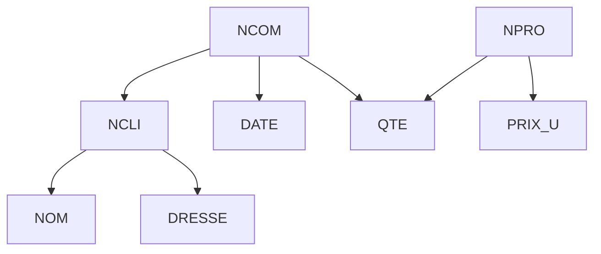

# Identifiants
clé, key, 标识符

> 1. **Identifiant（标识符）：** 它是属性（字段）的子集，其特征是在数据库中的任何时刻，具有相同标识符值的行不会超过一行。换句话说，标识符是用于唯一标识每一行的属性集合。
> 2. **Quelques propriétés（一些性质）：** 这里提到了一些关于标识符的属性，包括：
> 	- **identifiant minimal（最小标识符）：** 标识符的最小子集，满足标识符的基本条件。
> 	- **tout ensemble d'attributs dont une partie stricte est un identifiant est aussi un identifiant（任何一个属性集的严格子集都是标识符的一部分，也是一个标识符）：** 如果一个属性集的部分是标识符，那么整个属性集也是标识符，尽管可能不是最小标识符。
> 	- **l'ensemble des attributs d'une relation est un identifiant（关系的所有属性集都是标识符）：** 这可能是在强调关系的每个属性都是标识符的一部分。
> 	- **plusieurs identifiants minimaux peuvent coexister dans une relation（一个关系中可以存在多个最小标识符）：** 说明在一个关系中可以有多个满足标识符条件的最小子集。
> 	- **un attribut peut appartenir à plusieurs identifiants（一个属性可以属于多个标识符）：** 表明一个属性可以同时属于多个标识符。
> 	- **il est possible de calculer automatiquement les identifiants d'une relation（可以自动计算关系的标识符）：** 这可能指的是可以通过某种方法自动生成或计算关系的标识符。

因此，这段文本主要介绍了关于数据库中标识符的定义、属性和一些特性。在这个上下文中，"attributs"是构成标识符的元素，而"propriétés"则是关于标识符的一些性质或规则。

# Dépendances fonctionnelles(DF)
函数依赖

## Qu'est-ce que la DF

1. **Contrainte d'intégrité très importante du modèle relationnel（关系模型中非常重要的完整性约束）：** 函数依赖是关系数据库模型中的一个重要的完整性约束。它确保了数据库中数据的一致性和准确性。
2. **Proche de l'identifiant mais plus précis（接近标识符但更精确）：** 函数依赖与标识符有关，但更加具体。它描述了一个属性对另一个属性的影响关系。
3. **À la base de la théorie de la normalisation（是规范化理论的基础）：** 函数依赖是数据库规范化理论的基础。规范化的目的是减少冗余数据，提高数据库结构的优化程度。

Il y a une table

|        | ACHAT   |      |
| ------ | ------- | ---- |
| CLIENT | PRODUIT | PRIX |
| André  | Sucre   | 2,2  |
| Marc   | Sucre   | 2,2  |
| Marc   | Sel     | 1,4  |
| Anne   | Savon   | 1,4  |
| Anne   | Sel     | 1,4  | 

^7e40d6

On note: $ACHAT:PRODUIT\longrightarrow PRIX$, on avons donc: $PRODUIT\longrightarrow PRIX$

`PRODUIT` est un identifiant de `ACHAT[PRODUIT, PRIX]`

## Définition

> Dans une relation R(A,B,C,D), il existe une dépendance fonctionnelle A → B si, à tout instant, deux lignes de R qui ont même valeur de A ont aussi même valeur de B.
> 在关系 R 的任何时刻，如果两行具有相同的 A 值，那么它们也必须具有相同的 B 值。

对于表[ACHAT](#^7e40d6)，有：
1. `PRODUIT` détermine (fonctionnellement) `PRIX`；`PRODUIT` （函数上）决定 `PRIX`
2. `PRIX` dépend (fonctionnellement) de `PRODUIT`；`PRIX`（函数上） 依赖于 `PRODUIT`
3. `PRODUIT` est le **déterminant** et `PRIX` est le **déterminé** de la dépendance fonctionnelle；
   - 说明在这个函数依赖关系中，`PRODUIT` 是**决定因素**（déterminant），而 `PRIX` 是**被决定的因素**（déterminé）。

Note: Déterminant et déterminé peuvent être multicomposants
$$
\begin{align}
B \longrightarrow C,D \\
B,C \longrightarrow D
\end{align}
$$
上面两行只是举个例子，并没有因果关系；`,`表示 et 而非 ou

### 部分依赖与完全依赖

- 部分函数依赖(dépendance partielle)：Y不完全函数依赖于X。例如$A\longrightarrow C$，又有$AB\longrightarrow C$， 那么C就是部分函数依赖于AB的，这种情况会造成数据冗余
- 完全函数依赖(dépendance complète)：$X\longrightarrow Y$，并且对于$X$的任意真子集$X^{\prime}$，都有$X^{\prime}\nrightarrow Y$则称Y完全函数依赖于X。

- 传递函数依赖(dépendances transitives)：若$X\longrightarrow Y$，$Y\longrightarrow Z$，且$Z\nrightarrow Y$，$Y\nrightarrow X$，有$X\longrightarrow Z$，此时称$Z$对$X$有传递函数依赖。

## Graphe ADF(attributs + DF)

Il y a une relation : 
```
COM(
    NCLI,    // Numéro du client
    NOM,     // Nom du client
    ADRESSE, // Adresse du client
    NCOM,    // Numéro de commande(订单)
    DATE,    // Date de commande
    NPRO,    // Numéro de produit(产品)
    QTE,     // Quantité 数量
    PRIX_U   // Prix unitaire 单价
)

// Fonctions de dépendance
NCOM → NCLI      // Toute commande est émise par un client
NCLI → NOM       // Tout client a un nom
NCLI → ADRESSE   // Tout client a une adresse
NCOM → DATE      // Toute commande est passée à une date
NCOM, NPRO → QTE  // Dans toute commande, il y a une quantité par produit
NPRO → PRIX_U    // Tout produit a un (et un seul) prix unitaire
```

nous avons graphe ADF de la relation : 


于是，有这样的分类：
- Attribut externe : non déterminant（外部属性：非决定因素）
	- like: `DATE`, `NCLI`
- Attribut interne : déterminant（内部属性：决定因素）
	- like: `NCOM`
- DF externe : dont le déterminé est un attribut externe（外部函数依赖：其决定因素是一个外部属性）
	- like: `NCLI --> NOM`
- DF interne : dont le déterminé est un attribut interne（内部函数依赖：其决定因素是一个内部属性）
	- like: `NCOM --> NCLI`

## Les règles d'inférence d'Armstrong (Armstrong's axioms)

1. Réflexivité (Axiom of reflexivity; 自反律)
	Si $L \subseteq K$, alors $K \longrightarrow L$
	$=DF\ triviales$
2. Augmentation (Axiom of augmentation; 增广律)
	Si $K \longrightarrow B$, alors on a aussi $KA \longrightarrow B$
3. Transitivité (Axiom of transitivity; 传递律)
	Si $K \longrightarrow L$ et $L \longrightarrow M$, alors $K \longrightarrow M$

由这三个规律，可以推导出下面的规则，具体证明可见[wiki](https://en.wikipedia.org/wiki/Armstrong%27s_axioms)

4. Additivité (Composition)
	Si $K \longrightarrow A$ et $L \longrightarrow B$, alors $KL \longrightarrow AB$
	- (Union or Notation; 合并规则)
		Si $K \longrightarrow A$ et $K \longrightarrow B$, alors $K \longrightarrow AB$
5. Décomposabilité (Decomposition; 分解规则)
	Si $K \longrightarrow AB$, alors $K \longrightarrow A$ et $K \longrightarrow B$
6. Pseudo-transitivité (Pseudo transitivity; 伪传递规则)
	Si $K \longrightarrow L$ et $LA \longrightarrow M$, alors $KA \longrightarrow M$

## Fermeture 
闭包

> Fermeture d'un ensemble F de DF
> F 的闭包($F^{+}$)是使用 Armstrong 规则从 F 中推导出所有可能的函数依赖的集合。它包含 F 本身，是唯一的闭包。这个闭包提供了关于 F 中所有可能信息的集合。

1. _A_ → _B_
2. _B_ → _C_
3. _AB_ → _D_
on peut trouver les fermetures:
a. A → A (by Armstrong's reflexivity)
b. A → AB (by 1. and (a))
c. A → ABD (by (b), 3, and Armstrong's transitivity)
d. A → ABCD (by (c), and 2)

因此闭包是 A → ABCD。通过计算 A 的闭包，我们验证了 A 也是一个很好的候选键，因为它的闭包是关系中的每个数据值。[^closure]

## couvertures
覆盖

> F 的覆盖是通过使用 Armstrong 规则可以导出 F 的任何函数依赖的集合。
> 如果 G 中的每个 FD 都可以从 F 推断出来，则 F 覆盖 G（$G^+ \subseteq F^+$）[^cover]

### 最小覆盖(Irreducible function depending set)

如果函数依赖集 F 满足下列3个条件，则称F为最小依赖集：  
1. F 的函数依赖的每个右集仅包含一个属性
2. F 的函数依赖的每个左集都是不可约的。这意味着从左集中减少任何一个属性都会改变S的内容（F 将丢失一些信息）  
3. 减少任何功能依赖性都会改变 F 的内容[^irreducible]

每个函数依赖集 F 都有等价的最小覆盖 F'

# Contraintes d'inclusion et clés étrangères

## Propriétés
性质

可以认为$R$是一张表，$A$是一个属性

1. Réflexivité : $R[A] \subseteq R[A]$
2. Décomposabilité :
	Si on a $S[A,B] \subseteq R[A,B]$, on a aussi $S[A] \subseteq R[A]$ et $S[B] \subseteq R[B]$
3. Transitivité :
	Si on a $T[A] \subseteq S[A]$ et $S[A] \subseteq R[A]$, on a aussi $T[A] \subseteq R[A]$
4. Propagation des DF :
	Si on a $S[A,B] \subseteq R[A,B]$ et $R: A \longrightarrow B$, on a aussi $S: A \longrightarrow B$.
5. Propagation dans la projection :
	Si on a $S[A,B] \subseteq R[A,B]$ et $S^{\prime}=S[A,B,C]$, on a aussi $S^{\prime}[A,B] \subseteq R[A,B]$

# Calcul des identifiants d'une relation
获得候选码
## Procédure élémentaire (Proc1)

1. Un premier identifiant I est constitué de l’ensemble des attributs de la relation.
   - 首先，初始的候选键 I 包括关系中的所有属性。
2. On recherche dans I un attribut A externe; on retire A de I.
   - 然后，从 I 中找到一个外部属性 A，并将其从 I 中移除。
3. On répète l’étape 2 jusqu’à ce qu’il ne soit plus possible de retirer d’attribut à I.
   - 重复步骤2，直到不能再从 I 中移除属性为止。
4. I est un identifiant de la relation.
   - 最终得到的 I 就是关系的一个候选键。

这个方法的思想是从包含所有属性的初始集合开始，逐步移除外部属性，直到不能再移除为止。这样得到的集合就是关系的一个候选键，即一个唯一标识关系中元组的属性集合。

但是，Proc1 不能解决 attributs d'un circuit (环路属性)，找不到最小标识符

## 通用过程（Proc2）

1. Un identifiant est obtenu par application de la procédure Proc1
   - 首先，通过执行 Proc1 过程获得一个候选键。
2. Si cet identifiant n’est le siège d’aucune DF, la procédure est terminée
   - 如果这个候选键不是任何函数依赖的决定因素，那么过程就结束。

3. Sinon, le graphe ADF résiduel comporte un ou plusieurs circuits. Pour chaque attribut A appartenant à un circuit, on applique l’étape 4
   - 如果存在函数依赖决定这个候选键，则 ADF 图中会有一个或多个环路。对于每个环路中的属性 A，执行步骤 4。

4. On retire A du graphe ADF ainsi que toutes les DF dans lesquelles il apparaît. On applique au graphe résultant la procédure Proc2
   - 从 ADF 图中删除属性 A 以及包含它的所有函数依赖。对于剩余的图，应用 Proc2 过程。

这个过程的目的是处理具有环路的属性依赖图，通过逐步删除环路中的属性，直到无法继续为止。这确保了获得一个不包含冗余信息的候选键。

# Décomposition d'une relation
模式分解

## théorème de décomposition 

模式分解的准则：无损连接、保持函数依赖；无损连接：分解后再次自然连接，与分解前相同

$$
R(A,B,C,D): A \longrightarrow B \Rightarrow R = R[A,B] * R[A,C,D]
$$

Remarque（注意）

下面的操作不遵循规则，但完全有效

$$
\begin{align}
&ACHAT (CLI, PRO, PRIX):PRO \longrightarrow PRIX  \\
&\Rightarrow 
R1 (CLI, PRIX),R2 (CLI, PRO),R1[CLI] = R2[CLI]
\end{align}
$$

但是，不可逆
$$
ACHAT \subseteq R1 * R2
$$

# Normalisation d'une relation
范式


## 1NF
第一范式

- 所有属性都是不可分割的数据项
- Pour obtenir la 1NF, il faut avoir des valeurs atomique dans chaque cellule de la table.

## 2NF

- 在满足1NF的前提下，不包含非主属性对码的部分函数依赖（即每一个非主属性都完全函数依赖于码）
- Pour obtenir la 2NF, il faut supprimer les DF partielles

## 3NF

- 在满足2NF的前提下，不包含非主属性对码的传递函数依赖（即码应该直接决定非主属性，不能间接决定）
- Pour obtenir 3NF, il faut supprimer les DF transitives

[^closure]: https://en.wikipedia.org/wiki/Functional_dependency#Example
[^cover]: https://en.wikipedia.org/wiki/Functional_dependency#Covers
[^irreducible]: https://en.wikipedia.org/wiki/Functional_dependency#Irreducible_function_depending_set