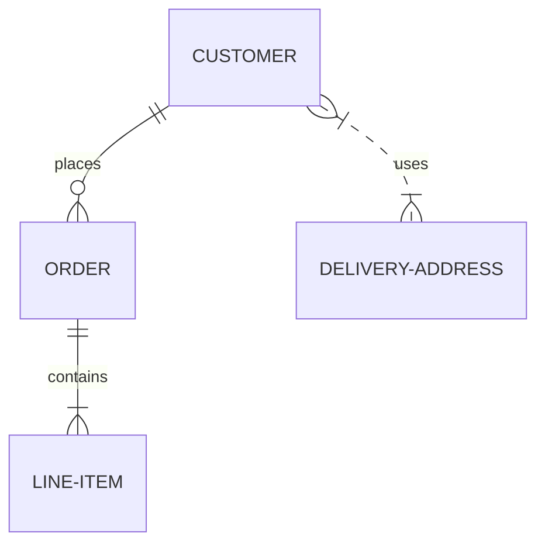

# Modélisation conceptuelle

# Modélisation logique

# Modélisation physique

# Entité – Relation Modélisation
 实体

- Modéliser/décrire un ensemble d'objets concrets ou abstraits avec les mêmes propriétés/caractères
- 用相同的属性/特征来描述/建模一组具体或抽象的对象。

如：
```sql
Cours( nomCours, NbCM, NbTD, …);
```

在E-R图中，使用矩形表示



# Représentation des Associations
关联的表示方式

在E-R图中，使用Losange ou Ovale（菱形或椭圆形）表示