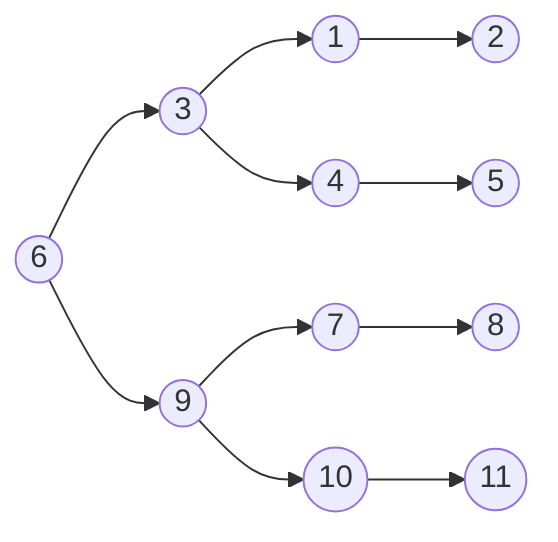

## 什么是树？

客观世界中许多事物存在层次关系，分层次组织在管理上具有更高的效率

```c
#define MAXSIZE 10;
typedef struct LNode *List;
struct LNode{
	ElementType Element[MAXSIZE];
	int length;
};
```

## 查找

根据某个关键字K，从集合R中找出关键字与K相同的记录。

1. 静态查找: 集合中记录是固定的，没有插入和删除操作，只有查找
2. 动态查找: 集合中记录是动态变化的，除查找，还可能发生插入和删除

### 静态查找

#### 顺序查找

```c 
int SequentialSearch(List Tbl,ElementType K){
	int i;
	Tbl->Element[0]=K;
	for(i=Tbl->length; Tbl->Element[i]!=K; i--);
	return i;
}
```

顺序查找算法的时间复杂度为$O(n)$

#### 二分查找

前提：假设n个数据元素的关键字满足有序（比如从小到大）$$k_1<k_2<\cdots<k_n$$并且是连续存放（数组），那么可以进行二分查找。

```c
int BinarySearch(List Tbl, ElementType K){
	// 在表Tbl中查找关键字为K的数据元素
    int mid, NotFound = 1;
    int left = 1;   // 定义左边界变量left，表示列表的起始位置
    int right = Tbl->length;   // 定义右边界变量right，表示列表的结束位置（初始为列表的长度）

    while (left <= right) {   // 当左边界小于等于右边界时进行循环
        mid = (left + right) / 2;   // 计算中间元素的索引

        if (K < Tbl->Element[mid]) {   // 如果要查找的元素K小于中间元素的值
            right = mid - 1;   // 调整右边界
        }
        else if (K > Tbl->Element[mid]) {   // 如果要查找的元素K大于中间元素的值
            left = mid + 1;   // 调整左边界
        }
        else {   // 如果要查找的元素K等于中间元素的值
            return mid;   // 返回中间元素的索引作为查找结果
        }
    }

    return NotFound;   // 循环结束仍未找到元素，则返回未找到的标识
}

```

##### 11个元素的二分查找判定树



1. 判定树上每个结点需要的查找次数刚好为该结点所在的层数。
2. 查找成功时查找次数不会超过判定树的深度。
3. n个结点的判定树的深度为log2N+1。
4. 平均查找次数$ASL=（4*4+4*3+2*2+1）/ 11 = 3$

## 树的定义

树（Tree）：n（n>=0）个结点构成的有限集合。n=0时，称为空树；对于任意一棵非空树，具有以下性质：
- 树中有一个称为“根（Root）”的特殊结点，用 r 表示；
- 其余结点可分为m(m>0)个互不相交的有限集T1，T2，... ，Tm，其中每个集合本身又是一棵树，称为原来树的“子树（SubTree）”

### 判断树与非树

1. 子树是不相交的。
2. 除了根节点外，每个结点有且仅有一个父节点。
3. 一棵N个结点的树有N-1条边。

> Q：有一个m棵树的集合（也叫森林）共有k条边，问这m颗树共有多少个结点？
> A：k+m。一条边对应一个结点，但是根节点是没有边对应的，所以结点会比边数多一个。m棵树多m个结点。所以是k+m。

## 树的术语

1. 结点的度（Degree）：结点的子树个数。
2. 树的度：树的所有结点中最大的度数。
3. 叶结点（Leaf）：度为0的结点。
4. 父结点（Parent）：有子树的结点是其子树的根节点的父结点。
5. 子结点（Child）：若A结点是B结点的父结点，则称B结点是A结点的子结点，子结点也称孩子结点。
6. 兄弟结点（Sibling）：具有同一父结点的各结点彼此是兄弟结点。
7. 路径和路径长度：经过的结点、经过的边个数。
8. 祖先结点（Ancestor）：沿树根到某一结点路径上的所有结点都是这个结点的祖先结点。
9. 子孙结点（Descendant）：某一结点的子树中的所有结点是这个结点的子孙。
10. 结点的层次（Level）：规定根结点在1层，其它任一结点的层数是其父结点的层数加1。
11. 树的深度（Depth）：最大层次

## 树的表示

###  儿子-兄弟表示法


