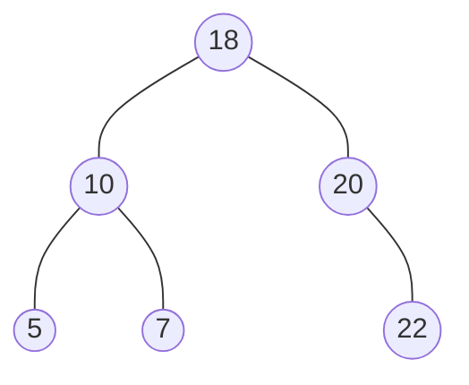
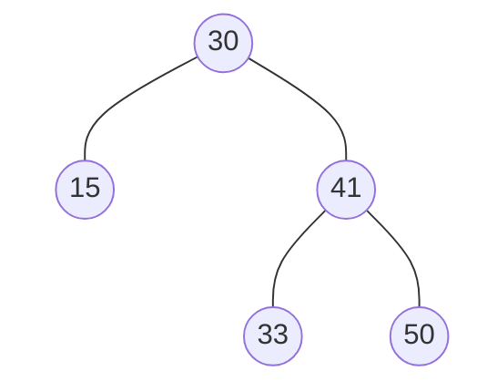

## 什么是二叉搜索树

**二叉搜索树**（BST，Binary Search Tree; ABR, Arbre Binaire de Recherche）， 也称二叉排序树或二叉查找树。

一棵二叉树，可以为空；如果不为空，满足以下性质：
1. 非空左子树的所有键值小于其根结点的键值。
2. 非空右子树的所有键值大于其根结点的键值。
3. 左、右子树都是二叉搜索树。

如下图，值为10的结点的右子树为7，比10小，不满足条件2，所以这棵树不是二叉搜索树。


而下图各个结点都满足条件，所以这棵树是二叉搜索树。


## 二叉搜索树操作的特别函数

### 二叉树的结构

```C
typedef int ElementType;
typedef struct TNode *Position;
typedef Position BinTree; /* 二叉树类型 */
struct TNode{ /* 树结点定义 */
    ElementType Data; /* 结点数据 */
    BinTree Left;     /* 指向左子树 */
    BinTree Right;    /* 指向右子树 */
};
```

### 根据键值找地址 `Find`

`Position Find( ElementType X, BinTree BST )`

1. 查找从根结点开始，如果树为空，返回`NULL`
2. 若搜索树非空，则根结点关键字和X进行比较，并进行不同处理：
	1. 若X小于根结点键值，只需在左子树中继续搜索
	2. 如果X大于根结点的键值，在右子树中进行继续搜索
	3. 若两者比较结果是相等，搜索完成，返回指向此结点的指针

如下为递归方式的代码
```C
Position Find( ElementType X, BinTree BST ){
	if( !BST ) return NULL; /*查找失败*/
	if( X > BST->Data )
		return Find( X, BST->Right ); /*在右子树中继续查找*/
	else if( X < BST->Data )
		return Find( X, BST->Left ); /*在左子树中继续查找*/
	else /* X == BST->Data */
		return BST; /*查找成功，返回结点的找到结点的地址*/
}
```
而使用递归会导致效率不高。恰巧这段代码又是尾递归的方式（尾递归就是程序分支的最后，也就是最后要返回的时候才出现递归），从编译的角度来讲，尾递归都可以用循环的方式去实现。由于非递归函数的执行效率高，可将“尾递归”函数改为迭代函数：
```C
Position IterFind( ElementType X, BinTree BST ){
	 while( BST ) {
		 if( X > BST->Data )
		 	BST = BST->Right; /*向右子树中移动，继续查找*/
		 else if( X < BST->Data )
		 	BST = BST->Left; /*向左子树中移动，继续查找*/
		 else /* X == BST->Data */
		 	return BST; /*查找成功，返回结点的找到结点的地址*/
	 }
	 return NULL; /*查找失败*/
}
```
**查找的效率决定于树的高度**

### 找最小值的地址

`Position FindMin( BinTree BST )`

最小元素一定是在树的最左分枝的端结点上

查找最小元素的递归函数：
```C
Position FindMin( BinTree BST ){
	 if( !BST ) 
	 	return NULL; /*空的二叉搜索树，返回NULL*/
	 else if( !BST->Left )
	 	return BST; /*找到最左叶结点并返回*/
	 else
	 	return FindMin( BST->Left ); /*沿左分支继续查找*/
}
```

### 找最大值的地址

`Position FindMax( BinTree BST )`

最大元素一定是在树的最右分枝的端结点上

查找最大元素的迭代函数
```C
Position FindMax( BinTree BST ){
	 if(BST )
	 	while( BST->Right )  /*沿右分支继续查找，直到最右叶结点*/
	 		BST = BST->Right;
	 return BST;
} 
```

### 二叉搜索树的插入

`BinTree Insert( BinTree BST, ElementType X )`

二叉搜索树在插入前，肯定要找到插入的位置。所以解决这个问题的关键就是要找到元素应该插入的位置，可以采用与`Find`类似的方法。


代码如下：
```C
BinTree Insert( BinTree BST, ElementType X ){
    if( !BST ){ /* 若原树为空，生成并返回一个结点的二叉搜索树 */
        BST = (BinTree)malloc(sizeof(struct TNode));
        BST->Data = X;
        BST->Left = BST->Right = NULL;
    }
    else { /* 开始找要插入元素的位置 */
        if( X < BST->Data )
            BST->Left = Insert( BST->Left, X );   /*递归插入左子树*/
        else  if( X > BST->Data )
            BST->Right = Insert( BST->Right, X ); /*递归插入右子树*/
        /* else X已经存在，什么都不做 */
    }
    return BST;
}
```

### 二叉搜索树的删除

要考虑以下三种情况：
1. 要删除的是叶结点
	直接删除，删除之后要修改其父结点指针，置为`NULL`
2. 要删除的结点只有一个孩子结点
	将被删除的结点的父结点的指针指向被删除的结点的孩子结点
3. 要删除的结点有左、右两棵子树
	用另一结点替代被删除结点：用**被删除结点**的**右子树的最小元素**或者**左子树的最大元素**替代被删除结点

```C
BinTree Delete( BinTree BST, ElementType X ) {
    Position Tmp; 
    if( !BST ) 
        printf("要删除的元素未找到"); 
    else {
        if( X < BST->Data ) 
            BST->Left = Delete( BST->Left, X );   /* 从左子树递归删除 */
        else if( X > BST->Data ) 
            BST->Right = Delete( BST->Right, X ); /* 从右子树递归删除 */
        else { /* BST就是要删除的结点 */
            /* 如果被删除结点有左右两个子结点 */ 
            if( BST->Left && BST->Right ) {
                /* 从右子树中找最小的元素填充删除结点 */
                Tmp = FindMin( BST->Right );
                BST->Data = Tmp->Data;
                /* 从右子树中删除最小元素 */
                BST->Right = Delete( BST->Right, BST->Data );
            }
            else { /* 被删除结点有一个或无子结点 */
                Tmp = BST; 
                if( !BST->Left )       /* 只有右孩子或无子结点 */
                    BST = BST->Right; 
                else                   /* 只有左孩子 */
                    BST = BST->Left;
                free( Tmp );
            }
        }
    }
    return BST;
}
```
