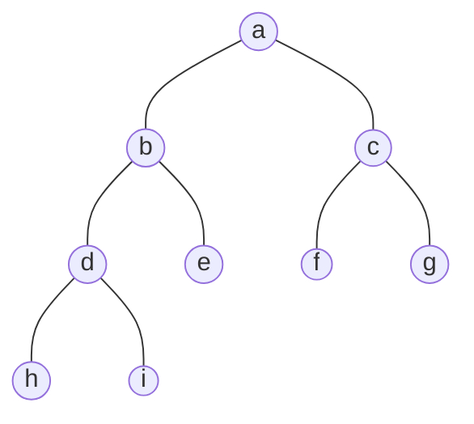

## 什么是堆(Heap; Tas)

**优先队列(Priority Queue)**：特殊的“队列”，取出元素的顺序是依照元素的**优先权（关键字）**大小，而不是元素进入队列的先后顺序。

### 若采用数组或链表实现优先队列

1. 数组 : 
	1. 插入：元素总是插入尾部 $\Theta(1)$
	2. 删除：查找最大（或最小）关键字 $\Theta(n)$
	    从数组中删去需要移动元素 $O(n)$
2. 链表: 
	1. 插入：元素总是插入链表的头部 $\Theta(1)$
	2. 删除：查找最大（或最小）关键字 $\Theta(n)$
	    删去结点 $\Theta(1)$
3. 有序数组: 
	1. 插入：找到合适的位置 $O( n )$ 或 $O(\log_{2} n )$
	    移动元素并插入 $O( n )$ 
	1. 删除：删去最后一个元素 $\Theta(1)$
4. 有序链表: 
	1. 插入：找到合适的位置 $O(n)$
	    插入元素 $\Theta(1)$
	3. 删除 — 删除首元素或最后元素 $\Theta(1)$

### 优先队列的完全二叉树表示



|     | a   | b   | c   | d   | e   | f   | g   | h   | i   |     |     |
| --- | --- | --- | --- | --- | --- | --- | --- | --- | --- | --- | --- |
| 0   | 1   | 2   | 3   | 4   | 5   | 6   | 7   | 8   | 9   | 10  | 11  |

堆有两个特性
- 结构性：用数组表示的完全二叉树；
- 有序性：任一结点的关键字是其子树所有结点的最大值(或最小值)
	- “最大堆(MaxHeap; Tas Max)” ,也称“大顶堆”：最大值
	- “最小堆(MinHeap; Tas Min)” ,也称“小顶堆” ：最小值

## 堆的抽象数据类型描述

类型名称：最大堆

数据对象集：完全二叉树，每个结点的元素值不小于其子结点的元素值。

操作集：创建一个空的最大堆、判断最大堆是否已满、将元素插入最大堆、判断最大堆是否为空、返回最大堆的最大元素。

### 最大堆的操作

把`MaxData`换成小于堆中所有元素的`MinData`，同样适用于最小堆。
#### 最大堆的创建

```C
typedef struct HeapStruct "MaxHeap";
struct HeapStruct{
	ElementType *Elements;	//存储堆元素的数组 
	int Size;				//堆的当前元素个数 
	int Capacity;			//堆的最大容量 
}; 
 
MaxHeap Create(int MaxSize){
	MaxHeap H = malloc(sizeof(struct HeapStruct));
	H->Elements = malloc((MaxSize+1)*sizeof(ElementType));
	//加1是因为数组是从下标为1开始存放的 
	H->Size=0;
	H->Capacity = MaxSize;
	H->Elements[0]=MaxData;
	//MaxData作为哨兵 
	return H;
}
```

#### 最大堆的插入

将新增结点插入到从其父结点到根结点的有序序列中
```C
void Insert(MaxHeap H, ElementType item){
/* 将元素item 插入最大堆H，其中H->Elements[0]已经定义为哨兵 */
	int i;
	if(IsFull(H)){
		printf("最大堆已满");
		return;
	}
	i = ++H->Size;/* i指向插入后堆中的最后一个元素的位置 */
	//i就是插入点的位置 
	for(;H->Elements[i/2]<item;i/=2){
		//H->Elements[i/2]就是该插入点的父结点的值 
		H->Elements[i]=H->Elements[i/2];/* 向下过滤结点 比交换数据要快*/
	}
	H->Elements[i]=item;/* 将item 插入 */
} 
```

#### 最大堆的删除

取出根结点（最大值）元素，同时删除堆的一个结点。
$$
T (N) = O ( log N )
$$

```C
ElementType DeleteMax( MaxHeap H ){ /* 从最大堆H中取出键值为最大的元素，并删除一个结点 */
    int Parent, Child;
    ElementType MaxItem, X;
    if ( IsEmpty(H) ) {
        printf("最大堆已为空");
        return ERROR;
    }
    MaxItem = H->Data[1]; /* 取出根结点存放的最大值 */
    /* 用最大堆中最后一个元素从根结点开始向上过滤下层结点 */
    X = H->Data[H->Size--]; /* 注意当前堆的规模要减小 */
    for( Parent=1; Parent*2<=H->Size; Parent=Child ) {
        Child = Parent * 2;
        if( (Child!=H->Size) && (H->Data[Child]<H->Data[Child+1]) )
            Child++;  /* Child指向左右子结点的较大者 */
        if( X >= H->Data[Child] ) break; /* 找到了合适位置 */
        else  /* 下滤X */
            H->Data[Parent] = H->Data[Child];
    }
    H->Data[Parent] = X;
    return MaxItem;
}
```

#### 最大堆的建立

建立最大堆：将已经存在的N个元素按最大堆的要求存放在一个一维数组中

方法：
1. 通过插入操作，将N个元素一个个相继插入到一个初始为空的堆中去，其时间代价最大为$O(N \log N)$
2. 在线性时间复杂度下建立最大堆，线性时间复杂度 $T(n)=O(n)$
	1. 将N个元素按输入顺序存入，先满足完全二叉树的结构特性
	2. 调整各结点位置，以满足最大堆的有序特性

```C
/*----------- 建造最大堆 -----------*/
void PercDown( MaxHeap H, int p ){ /* 下滤：将H中以H->Data[p]为根的子堆调整为最大堆 */
    int Parent, Child;
    ElementType X;
    X = H->Data[p]; /* 取出根结点存放的值 */
    for( Parent=p; Parent*2<=H->Size; Parent=Child ) {
        Child = Parent * 2;
        if( (Child!=H->Size) && (H->Data[Child]<H->Data[Child+1]) )
            Child++;  /* Child指向左右子结点的较大者 */
        if( X >= H->Data[Child] ) break; /* 找到了合适位置 */
        else  /* 下滤X */
            H->Data[Parent] = H->Data[Child];
    }
    H->Data[Parent] = X;
}
void BuildHeap( MaxHeap H ){ /* 调整H->Data[]中的元素，使满足最大堆的有序性  */
  /* 这里假设所有H->Size个元素已经存在H->Data[]中 */
    int i;
    /* 从最后一个结点的父节点开始，到根结点1 */
    for( i = H->Size/2; i>0; i-- )
        PercDown( H, i );
}
```