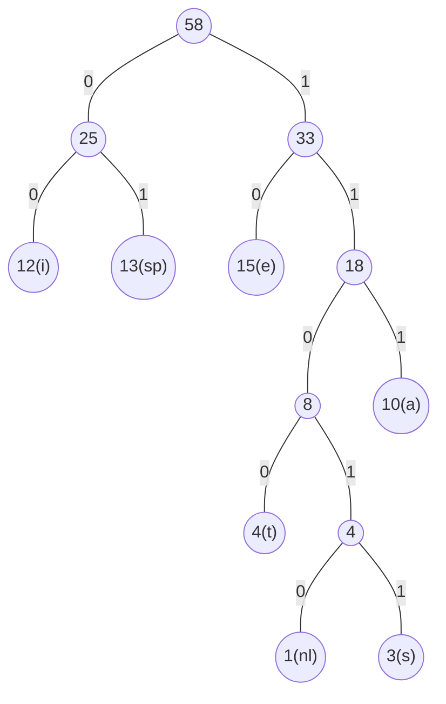

# 哈夫曼树

## 什么是哈夫曼树

根据结点不同的查找频率构造更有效的搜索树

定义：
- 带权路径长度(WPL)：设二叉树有n个叶子结点，每个叶子结点带有权值$w_k$，从根结点到每个叶子结点的长度为$l_{k}$，则每个叶子结点的带权路径长度之和就是：$WPL=\sum\limits_{k=1}^nw_{k}l_{k}$
- 最优二叉树或哈夫曼树: WPL最小的二叉树

 例：有五个叶子结点，权值分别为[1,2,3,4,5]，用此权值序列可以构造出不同的多个二叉树
 
 $WPL = 1X_1 + 2X_2 + 3X_3 + (5+4)X_4 = 50$


$WPL = 3X_2 + (4+5)X_2 + (1+2)X_3 = 33$

### 哈夫曼树的构造

整体复杂度为$O(N \log N)$

```C
typedef struct TreeNode *HuffmanTree;
struct TreeNode{
	int Weight;
	HuffmanTree Left,Right;
}; 
HuffmanTree Huffman(MinHeap H){
/* 假设H->Size个权值已经存在H->Elements[]->Weight里 */
	int i;
	HuffmanTree T;
	BuildMinHeap(H);/*将H->Elements[]按权值调整为最小堆*/
	for(i = 1; i < H->Size; i++){ /*做H->Size-1次合并*/
		T=malloc(sizeof(struct TreeNode));/*建立新结点*/
		T->Left = DeleteMin(H);/*从最小堆中删除一个结点，作为新T的左子结点*/
		T->Right = DeleteMin(H);/*从最小堆中删除一个结点，作为新T的右子结点*/
		T->Weight = T->Left->Weight+T->Right->Weight;/*计算新权值*/
		Insert(H,T);/*将新T插入最小堆*/
	} 
	T = DeleteMin(H);
	return T;
}
```

### 哈夫曼树的特点

1. 没有[度](3.1%20树与树的表示.md#树的术语)为1的结点
2. n个叶子结点的哈夫曼树共有2n-1个结点
3. 哈夫曼树的任意非叶结点的左右子树交换后仍是哈夫曼树
4. 对同一组权值，存在不同构的两棵哈夫曼树。

# 哈夫曼编码

给定一段字符串，如何对字符进行编码，使得该字符串的编码存储空间最小。

例：假设有一段文本包含58个字符，并由以下7个字符字符构成：a，e，i，s，t，空格(sp)，换行(nl)，只是出现的次数不同。如何对这7个字符编码（只能用0和1表示一个字符）？

方法
1. 用等长ASCII码：（每个字符用8位表示）58X8=464位
2. 用等长3位编码：（3位数，每位选择0或1表示，能表示8种字符）58X3=174位
3. 出现频率高的字符编码短，出现频率低的字符编码长

其中方法3要求避免编码二义性，可以用二叉树进行编码。

- 前缀码(prefix code)：任何字符的编码都不是另一字符编码的前缀：可以无二义地解码

## 二叉树用于编码

- 左右分支：0、1
- 字符只在叶结点上

例解：

| $C_{i}$ | a   | e   | i   | s   | t   | sp  | nl  |
| ------- | --- | --- | --- | --- | --- | --- | --- |
| $f_{i}$ | 10  | 15  | 12  | 3   | 4   | 13  | 1   | 


所以有：
```
a: 111
e: 10
i: 00
s: 11011
t: 1100
sp: 01
nl: 11010
```

$$
\begin{align}
Cost &= 3\times10 + 2\times15 \\
&+ 2\times12 + 5\times3 \\
&+ 4\times4 + 2\times13 \\
&+ 5\times1 \\
&= 146
\end{align}
$$