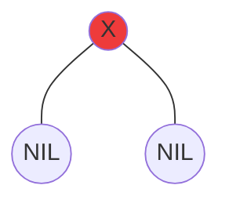
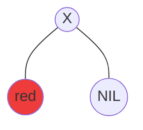
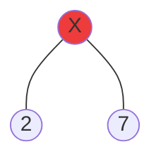

# Définition

一种自平衡的二叉树搜索树。可在 $O(\log N)$ 时间内完成查找、增加、删除等操作。

根节点都是黑色的，叶节点不储存数据。红色节点的字节点都是黑色的，没有相邻的红色节点，任意节点到叶子的所有路径都包含相同数量的黑色节点（该数量称为黑色高度）。

# Propriétés

1. 节点是红色或黑色
2. 根是黑色
3. 所有叶子都是黑色（叶子是NIL节点）
4. 每个红色节点必须有两个黑色的子节点（从每个叶子到根的所有路径上不能有两个连续的红色节点）  
5. 从任一节点到其每个叶子的所有简单路径都包含相同数目的黑色节点（简称黑高）

# 插入

前提：插入节点是红色

1. 插入的节点为根节点，插入后变黑
2. 母节点为黑色，直接插入，不需要调整
3. 插入节点 N 的母节点 P 是红色：
	

# 删除

只考三种情况（删斜体节点）：
1. 只有叶子节点的*红色节点*：

2. *黑色节点*只有单个有值的子节点

删掉后把红色节点移上去

3. *红色节点*有两个黑色子节点

删掉后把左子树最大节点或右子树最小节点提上去，并把另一个没被提上去的子节点的颜色改为红色

[参考：一文带你彻底读懂红黑树（附详细图解）](https://zhuanlan.zhihu.com/p/91960960))